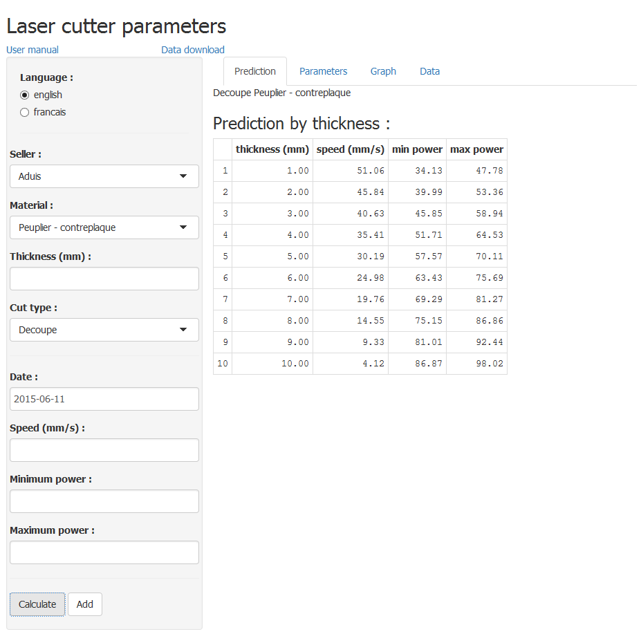
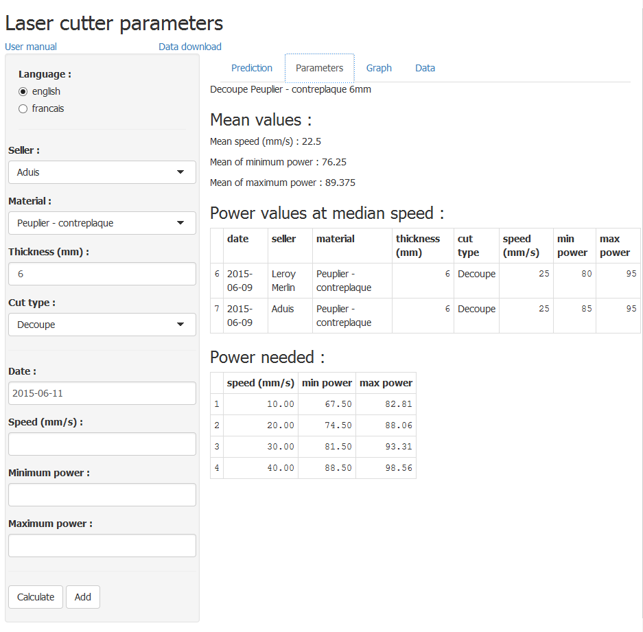
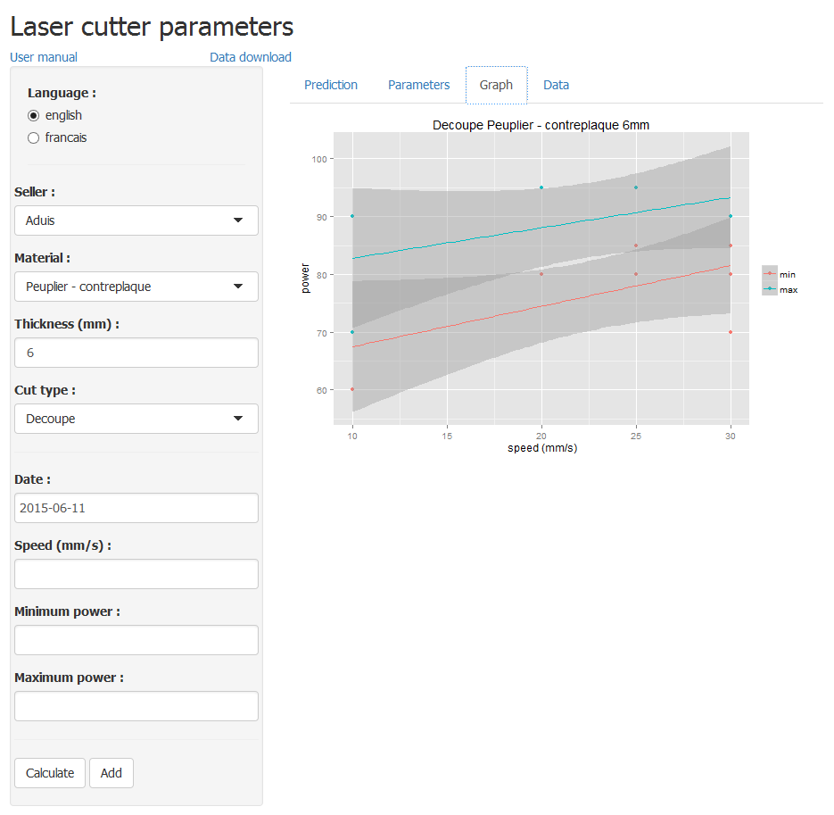
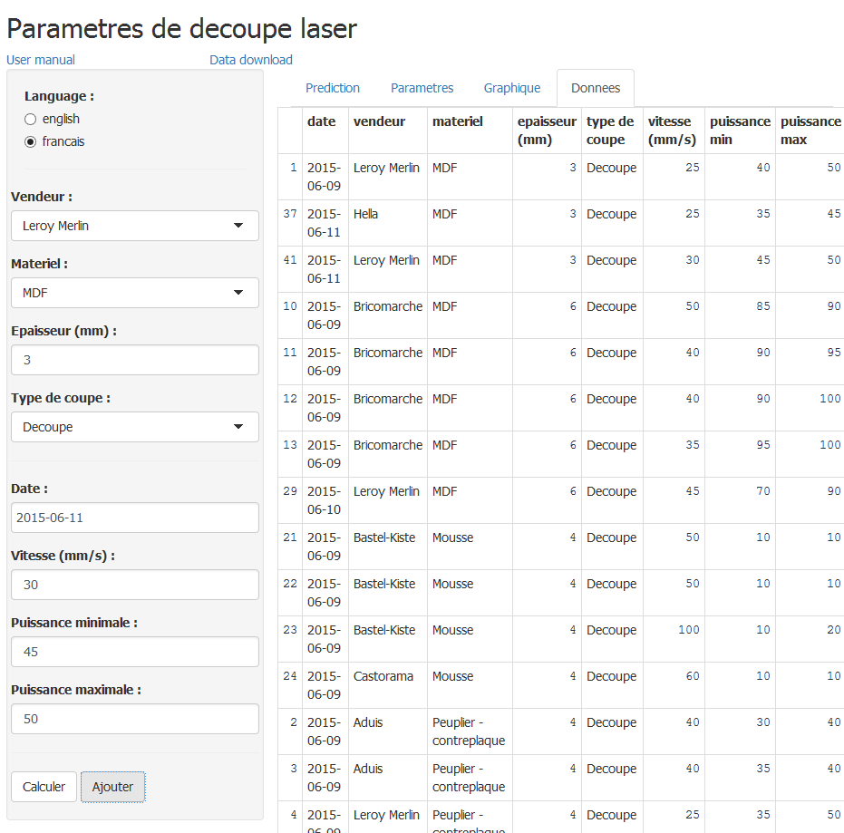

## Introduction

The application deals with the task of predicting the parameters that need to be used for a laser cutter, depending on the material to cut.

3 parameters need to be set on the Laser Cutter for a material :
* the cutting speed (denoted by speed)
* the minimum power the laser cutter has to use, for curves (denoted by minimum power)
* the maximum power the laser cutter has to use, for straight lines (denoted by maximum power)

The application simplifies the task of setting those parameters by keeping parameters from previously cut materials and predicting parameters for new materials.

## Layout of the screen

The screen is separated in parts:

* 2 download links are on the top below the title. One is for this page and the other one gives ou the raw data.

* The left panel contains the input area and the buttons for the 2 possible actions : "compute" and "add"

* The right part of the screen contains output tabs. Those tabs are depicted in figures 1 to 4.
 

## Input

The input is separated into 4 parts :

* The language selection

* The material attributes

* The laser cutter attributes

* The command buttons

The seller is only mentionned for informative purposes in the raw data. It is not used for selections but only for addition to the raw data.

## The language selection

Your can select the language by switching the position between english and french. Labels on the user interface are changed automatically, but you need to launch the computation again if you want the headers of the tables to be in that new language.

## Adding new cutting parameters

In other to add new cutting parameters, you need to fill all informations (seller, material, thickness, cut type, date, speed, minimum power and maximum power) and hit the "Add" button. The data will be added to the raw dataset.

## Getting raw data

There are two ways to get raw data. You can either visualize it in the "Data" tab or download it in a csv format file using the "Data download" link button.

## Predicting and computing parameters

You need to gives the material and cut type to get some usefull information out of the data. The thickness is optional. 

You can then hit the "Calculate" button to get prediction and/or compute parameters for your material.

### Prediction by tickness

When you hit "Calculate" and have enough data, you get the prediction by thickness computed from the material and the cut type. A linear regression estimates the parameters for each tickness between 1 and 10 as long as they are sensible (the power cannot be more than 100%, the speed cannot be negative).

### Parameters and Graph

If you also fill the htickness and have anough data for that tickness, you can get parameter estimation for that thickness as well as a graph showing data points along with a speed vs power regression line.

Usefull data shown that can be useful are mean values, the values at median speed given by a user and power values for different speeds. So you can choose the values according to your accuracy(speed)/power tradeoff choice.