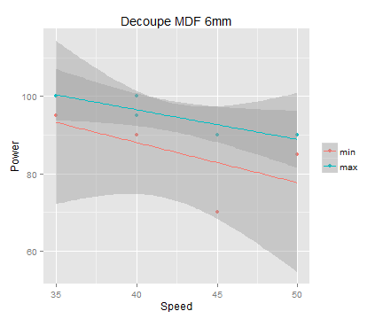

## The problem

1. Laser cutter parameters are hard to estimate
2. Tests are needed 
  * waste of time
  * waste of material
  * potential fire (safety issue)
3. When using differents materials
  * parameters are hard to remember
  * making a list could be long
4. When using differents thicknesses
  * different power
  * different speed

---

## The solution

1. Create a database of parameters
  * for different materials
  * for different thicknesses
  
2. Estimate parameters for a material
  * find the closest match (with power median speed)
  * find power for different speeds (saving time)
  * give only power values the machine can deliver
  
3. Estimate parameters for thicknesses
  * when the material has been used before
  * when that thickness is not in the database
  * by linear regression

---

## The software

1. Multilangual (English / French)

2. Add/download known laser cutter parameters

3. Predictions and a graph to check linear assumption

---

## Example of prediction by thickness

1. Example of computed values for a MDF cut

<!-- html table generated in R 3.2.0 by xtable 1.7-4 package -->
<!-- Fri Jun 12 16:23:24 2015 -->
<table border=1>
<tr> <th>  </th> <th> Thickness </th> <th> Speed </th> <th> Minimum power </th> <th> Maximum power </th>  </tr>
  <tr> <td align="right"> 2 </td> <td align="right"> 2.00 </td> <td align="right"> 21.56 </td> <td align="right"> 24.67 </td> <td align="right"> 32.78 </td> </tr>
  <tr> <td align="right"> 3 </td> <td align="right"> 3.00 </td> <td align="right"> 26.67 </td> <td align="right"> 40.00 </td> <td align="right"> 48.33 </td> </tr>
  <tr> <td align="right"> 4 </td> <td align="right"> 4.00 </td> <td align="right"> 31.78 </td> <td align="right"> 55.33 </td> <td align="right"> 63.89 </td> </tr>
  <tr> <td align="right"> 5 </td> <td align="right"> 5.00 </td> <td align="right"> 36.89 </td> <td align="right"> 70.67 </td> <td align="right"> 79.44 </td> </tr>
  <tr> <td align="right"> 6 </td> <td align="right"> 6.00 </td> <td align="right"> 42.00 </td> <td align="right"> 86.00 </td> <td align="right"> 95.00 </td> </tr>
   </table>

 * Values above 6mm are not show because the laser cutter is not powerful enough to cut above. No need to try -> saves time and material.

 * The tickness value of 1mm is not shown because the linera regression gives a minimum power value less than the minimum the laser can deliver.

